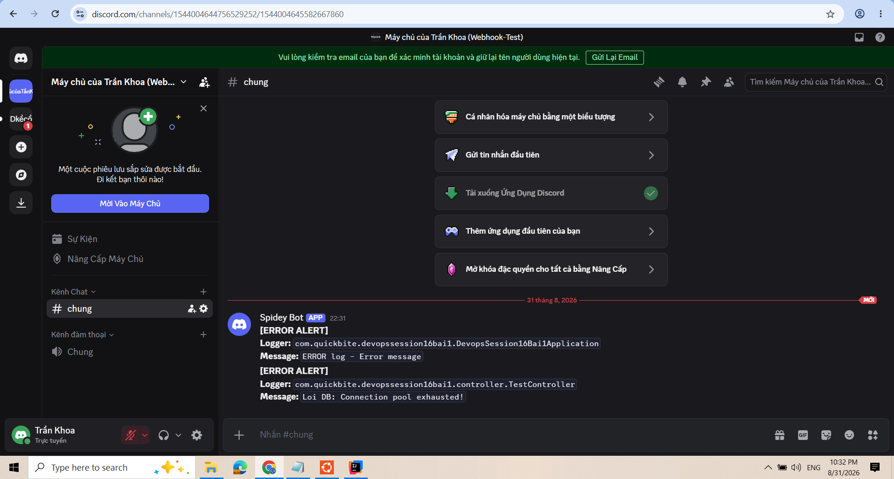

1. Custom Appender Gửi Cảnh Báo Log ERROR Đến Discord Webhook

Bước 1: Viết class DiscordAppender gửi HTTP Request tới Webhook URL

package com.quickbite.devopssession16bai1.logging;

import ch.qos.logback.classic.Level;
import ch.qos.logback.classic.spi.ILoggingEvent;
import ch.qos.logback.core.AppenderBase;

import java.net.URI;
import java.net.http.HttpClient;
import java.net.http.HttpRequest;
import java.net.http.HttpResponse;

public class DiscordAppender extends AppenderBase<ILoggingEvent> {

    private String webhookUrl;

    public void setWebhookUrl(String webhookUrl) {
        this.webhookUrl = webhookUrl;
    }

    @Override
    protected void append(ILoggingEvent eventObject) {
        // Chỉ xử lý khi log ở mức ERROR
        if (eventObject.getLevel().levelInt == Level.ERROR_INT) {
            if (webhookUrl == null || webhookUrl.isBlank()) {
                return;
            }
            try {
                String message = eventObject.getFormattedMessage();
                String loggerName = eventObject.getLoggerName();

                // Chuẩn hóa chuỗi tránh lỗi JSON Syntax
                String safeMessage = message.replace("\\", "\\\\").replace("\"", "\\\"");

                // Payload JSON gửi lên Discord Webhook
                String jsonPayload = String.format(
                        "{\"content\": \" **[ERROR ALERT]**\\n**Logger:** `%s`\\n**Message:** `%s`\"}",
                        loggerName, safeMessage
                );

                HttpClient client = HttpClient.newHttpClient();
                HttpRequest request = HttpRequest.newBuilder()
                        .uri(URI.create(webhookUrl))
                        .header("Content-Type", "application/json")
                        .POST(HttpRequest.BodyPublishers.ofString(jsonPayload))
                        .build();

                // Gửi HTTP Request bất đồng bộ
                client.sendAsync(request, HttpResponse.BodyHandlers.ofString());
            } catch (Exception e) {
                addError("Failed to send log to Discord Webhook", e);
            }
        }
    }
}

Bước 2: Cấu hình logback-spring.xml tích hợp DiscordAppender

<!--<configuration>-->

<!--    &lt;!&ndash; Appender xuat Log ra Console duoi dinh dang JSON &ndash;&gt;-->
<!--    <appender name="CONSOLE_JSON" class="ch.qos.logback.core.ConsoleAppender">-->
<!--        <encoder class="net.logstash.logback.encoder.LogstashEncoder" />-->
<!--            <charset>UTF-8</charset>-->
<!--    </appender>-->

<!--    &lt;!&ndash; Root Logger &ndash;&gt;-->
<!--    <root level="INFO">-->
<!--        <appender-ref ref="CONSOLE_JSON" />-->
<!--    </root>-->

<!--</configuration>-->

<configuration>

    <appender name="CONSOLE" class="ch.qos.logback.core.ConsoleAppender">
        <encoder>
            <pattern>%d{yyyy-MM-dd HH:mm:ss} [%thread] %-5level %logger{36} - %msg%n</pattern>
        </encoder>
    </appender>

    <!-- Thêm Custom Discord Appender -->
    <appender name="DISCORD" class="com.quickbite.devopssession16bai1.logging.DiscordAppender">
        <webhookUrl>https://discord.com/api/webhooks/1544004906501808171/MKzjxKFQ0T9_THgee9Lr9vi_EYaI-4JFtaXk4UE4pjTEQvZFQbmkL8ry73v7DEIyOc7_</webhookUrl>
    </appender>

    <root level="INFO">
        <appender-ref ref="CONSOLE" />
        <appender-ref ref="DISCORD" />
    </root>

</configuration>

Bước 3: Viết Controller kích hoạt log ERROR 

package com.quickbite.devopssession16bai1.controller;

import org.slf4j.Logger;
import org.slf4j.LoggerFactory;
import org.springframework.web.bind.annotation.GetMapping;
import org.springframework.web.bind.annotation.RequestMapping;
import org.springframework.web.bind.annotation.RestController;

@RestController
@RequestMapping("/api/test")
public class TestController {
    private static final Logger logger = LoggerFactory.getLogger(TestController.class);

    @GetMapping("/error")
    public String triggerError() {
        logger.error("Loi DB: Connection pool exhausted!");
        return "Triggered ERROR log successfully!";
    }
}

Bước 4 : Khởi Chạy & Kiểm Thử

Chạy ứng dụng Spring Boot:
./gradlew bootRun

Lệnh kiểm thử API:
curl.exe http://localhost:8080/api/test/error

### 🖼️ Ảnh 1: Kênh chat Discord nhận được thông báo cảnh báo real-time khi ứng dụng xuất hiện log ERROR

2. Giải Thích Lý Thuyết & Đáp Án

Nguyên nhân cần tạo Custom Appender trong Logback:
- Mặc định Logback chỉ hỗ trợ ghi log ra Console hoặc File. Trong môi trường hệ thống phân tán (Microservices), khi xảy ra sự cố nghiêm trọng (Exception/ERROR), việc chủ động đẩy thông báo tức thì (Real-time Alerting) giúp đội ngũ Dev/DevOps phát hiện và xử lý sự cố ngay lập tức mà không cần ngồi trực màn hình giám sát 24/24.

Cơ chế hoạt động và lợi ích của Discord Webhook Alerting:
- Cơ chế: Mỗi khi ứng dụng ghi nhận log ở mức ERROR, DiscordAppender sẽ tự động bắt lấy sự kiện (intercept log event), trích xuất thông tin Logger và Message, đóng gói thành JSON payload và gửi HTTP POST request tới Discord Webhook URL một cách bất đồng bộ (sendAsync).
- Lợi ích: Đảm bảo luồng chính của ứng dụng không bị ảnh hưởng hiệu năng (non-blocking thread pool), hỗ trợ cảnh báo thời gian thực chuẩn xác và tự động hóa.
